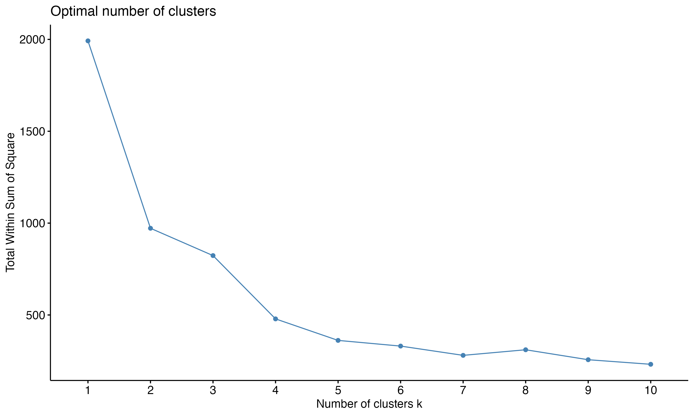
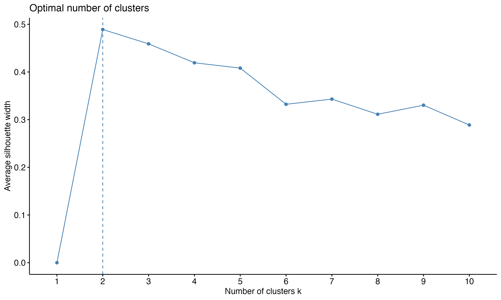
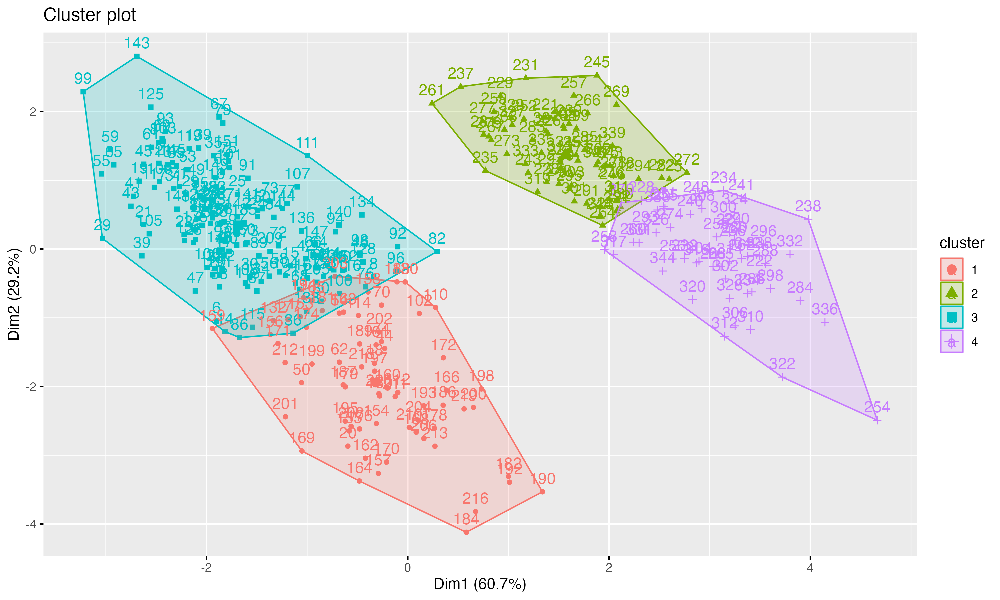
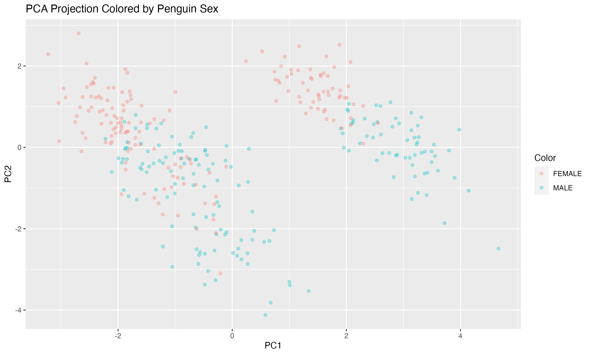
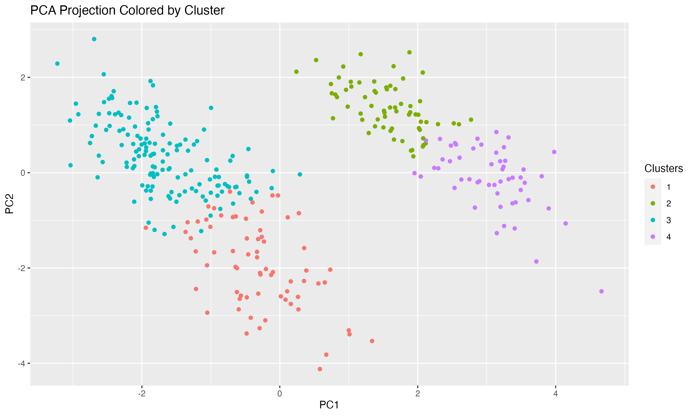
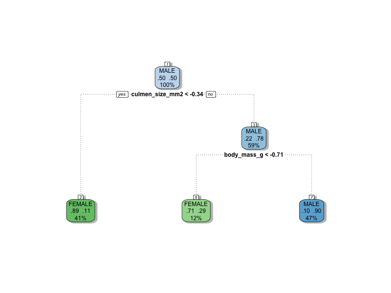
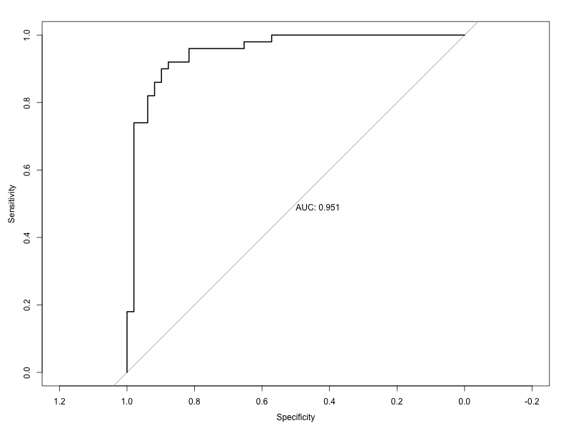

## Dataset

This dataset, penguins_size.csv, was sourced from Kaggle.
- [Kaggle Data Source: penguins_size.csv](https://www.kaggle.com/datasets/parulpandey/palmer-archipelago-antarctica-penguin-data)

- "Cite: Data are available by CC-0 license in accordance with the Palmer Station LTER Data Policy and the LTER Data Access Policy for Type I data."

- "Gorman KB, Williams TD, Fraser WR (2014) Ecological Sexual Dimorphism and Environmental Variability within a Community of Antarctic Penguins (Genus Pygoscelis). PLoS ONE 9(3): e90081. doi:10.1371/journal.pone.0090081"

## RMarkdown Code

- [View Data Science Fundamentals Report](https://kvellian.github.io/ds_fundamentals/assets/path/ds_fundamentals_KV.html)

## Purpose

This project explores machine learning algorithms to predict penguin gender, with R.


**Our target variable will be penguin gender.**


- Part 1. Data Exploration
- Part 2. Data Cleaning
- Part 3. Data Preprocessing
- Part 4. Clustering
- Part 5. Classification 
- Part 6. Evaluation


## Part 1. Data Exploration

- Original data: 344 rows, 7 columns

**Categorical Variables**

| Variable    | Description                                           | Unique Values                      |
|-------------|-------------------------------------------------------|------------------------------------|
| Species     | Penguin species                                      | Adelie, Chinstrap, Gentoo         |
| Island      | Island name in the Palmer Archipelago (Antarctica)   | Torgersen, Biscoe, Dream           |
| Sex         | Penguin gender                                       | MALE, FEMALE, NA, “.”              |

**Numerical Variables**

| Measurement           | Mean   | Min    | Max    |
|-----------------------|--------|--------|--------|
| Culmen Length (mm)    | 43.92  | 32.10  | 59.60  |
| Culmen Depth (mm)     | 17.15  | 13.10  | 21.50  |
| Flipper Length (mm)   | 200.90 | 172.00 | 231.00 |
| Body Mass (g)         | 4202   | 2700   | 6300   |

After exploring the data further, there appear to be 2 NAs in each of the columns:
culmen_length_mm, culmen_depth_mm, flipper_length_mm, body_mass_g. 


At first glance, the sex column has 10 NAs with 1 entry with the unique chr of ".". This "." appears to be a placeholder for an unknown data point/ missing data. In total, there are 11 NAs, considering the ".".


## Part 2. Data Cleaning

Let's consider the missing NAs and determine how much effect they have on the penguin_size data. First, I'll convert the single "." entry in the sex column to NA.

After calculating the proportion of missing data per column to see the significance of its impact on the data, here are the results:

| Variable            | Missing Percentage |
|---------------------|--------------------|
| species             | 0%                 |
| island              | 0%                 |
| culmen_length_mm    | 0.58%              |
| culmen_depth_mm     | 0.58%              |
| flipper_length_mm   | 0.58%              |
| body_mass_g         | 0.58%              |
| sex                 | 3.20%              |

The sex column has the most significant impact on the data, with 3.20% contributing to missing NAs. As opposed to 0.58% for culmen_length_mm, culmen_depth_mm, flipper_length_mm, and body_mass_g.


Considering, 3.20% is relatively low, I will drop the NAs since its removal should not have too large of an effect on predictability. After dropping the NAs, 11 rows have been removed, and the dataset now contains 333 rows.


## Part 3. Data Preprocessing

In this step, let's create 2 new columns:
- culmen_size_mm2: This will be the value of (culmen length x culmen depth), to explore the data more and see if adding this variable can help with prediction accuracy.

  
- body_mass_lbs: Converting the body_mass_g column from grams to pounds (body_mass_lbs = body_mass_g / 453.59237).

Next, I'll convert the categorical variables into factors. I'll also prepare a subset of the penguin_size data without the class labels to perform clustering. Afterward, I'll preprocess the data using the center-scaled method.

Since, we're going to perform predictions using other classifiers, I'll partition the data after using a 70/30 train-test split and preprocess the data when creating the classifier models.

      # Center scale allows us to standardize the data
      preproc <- preProcess(predictors_clustering, method = c("center", "scale"))
      
      # We have to call predict to fit our data based on preprocessing
      # Using predictors_clustering for Clustering
      predictors_clustering <- predict(preproc, predictors_clustering)
      
      # Partitioning the data to be used in Classification
      index = createDataPartition(y = penguin_size$sex, p = 0.7, list=FALSE)
      
      # Everything in the generated index list
      train_penguin = penguin_size[index,]
      
      # Everything except the generated indices
      test_penguin = penguin_size[-index,]

## Part 4. Clustering

Let's use kmeans to determine the best number for K before clustering. Using the plots for the Within Sum of Squares method and the Silhouette method.
- Using the Within Sum of Squares method, K = 4 represents the last non flat slope, or some argue that we should use K = 5 because that is the last point before the slope goes flat.
- Using the Silhouette method, K = 2.





Either option can be justified but since the K = 4 is the second best option for the silhouette score it is a promising option for both. Using K = 4 as suggested by the plots we can fit our model using the kmeans function.

Below are the plots created with K = 4

- Cluster plot


- PCA Projection Colored by Penguin Gender


- PCA Projection Colored by Cluster


## Part 4. Clustering

Now that we've partitioned that data in part 3. Data Preprocessing, let's preprocess the data as we create the classifiers.

Using SVM, and grid search to tune for C: The final value used for the model was C = 0.1. 
- Accuracy was 0.9777766.


````
svm_grid
````
````
Support Vector Machines with Linear Kernel 

234 samples
  8 predictor
  2 classes: 'FEMALE', 'MALE' 

Pre-processing: centered (10), scaled (10) 
Resampling: Cross-Validated (10 fold, repeated 25 times) 
Summary of sample sizes: 211, 210, 211, 211, 210, 211, ... 
Resampling results across tuning parameters:

  C      ROC        Sens       Spec     
  1e-05  0.2668214  0.1937576  0.9116364
  1e-04  0.8836749  0.1933939  0.9112727
  1e-03  0.8836446  0.8833030  0.6864545
  1e-02  0.9632826  0.8945152  0.9023333
  1e-01  0.9777766  0.8927879  0.9305455
  1e+00  0.9764396  0.9048182  0.9250606
  1e+01  0.9749635  0.9105152  0.9171212
  1e+02  0.9741568  0.9092121  0.9110909
  1e+03  0.9733584  0.9055758  0.9047576

ROC was used to select the optimal model using the largest value.
The final value used for the model was C = 0.1.
````

Using KNN, and tuning the choice of k plus the type of distance function: The final values used for the model were kmax = 7, distance = 2 and kernel = cos.
- Accuracy was 0.9228261.

````
kknn_fit
````
````
k-Nearest Neighbors 

234 samples
  8 predictor
  2 classes: 'FEMALE', 'MALE' 

Pre-processing: centered (10), scaled (10) 
Resampling: Cross-Validated (10 fold) 
Summary of sample sizes: 211, 210, 211, 211, 211, 210, ... 
Resampling results across tuning parameters:

  kmax  kernel       distance  Accuracy   Kappa    
  1     rectangular  1         0.8755435  0.7508191
  1     rectangular  2         0.8759058  0.7515104
  1     rectangular  3         0.8759058  0.7517089
  1     cos          1         0.8755435  0.7508191
  1     cos          2         0.8759058  0.7515104
  1     cos          3         0.8759058  0.7517089
  2     rectangular  1         0.8755435  0.7508191
  2     rectangular  2         0.8759058  0.7515104
  2     rectangular  3         0.8759058  0.7517089
  2     cos          1         0.8755435  0.7508191
  2     cos          2         0.8759058  0.7515104
  2     cos          3         0.8759058  0.7517089
  3     rectangular  1         0.9143116  0.8284392
  3     rectangular  2         0.9143116  0.8281082
  3     rectangular  3         0.8967391  0.7927771
  3     cos          1         0.8969203  0.7935885
  3     cos          2         0.8885870  0.7766558
  3     cos          3         0.9012681  0.8020682
  4     rectangular  1         0.9143116  0.8284392
  4     rectangular  2         0.9143116  0.8281082
  4     rectangular  3         0.8967391  0.7927771
  4     cos          1         0.9012681  0.8023998
  4     cos          2         0.9014493  0.8024129
  4     cos          3         0.9097826  0.8189458
  5     rectangular  1         0.9057971  0.8113609
  5     rectangular  2         0.9144928  0.8285204
  5     rectangular  3         0.8925725  0.7843147
  5     cos          1         0.9097826  0.8196108
  5     cos          2         0.8972826  0.7940796
  5     cos          3         0.8971014  0.7936014
  6     rectangular  1         0.9057971  0.8111629
  6     rectangular  2         0.9144928  0.8285204
  6     rectangular  3         0.9012681  0.8016041
  6     cos          1         0.9097826  0.8196108
  6     cos          2         0.9057971  0.8110296
  6     cos          3         0.8971014  0.7934671
  7     rectangular  1         0.9099638  0.8194962
  7     rectangular  2         0.9184783  0.8363105
  7     rectangular  3         0.9014493  0.8021503
  7     cos          1         0.9141304  0.8282236
  7     cos          2         0.9228261  0.8452535
  7     cos          3         0.9141304  0.8274952

Accuracy was used to select the optimal model using the largest value.
The final values used for the model were kmax = 7, distance = 2 and kernel = cos.
````

Using Decision Tree, and basic rpart method, the final value used for the model was cp = 0.01724138.
- Accuracy was 0.8425231.

````
decision_tree
````
````
CART 

234 samples
  8 predictor
  2 classes: 'FEMALE', 'MALE' 

Pre-processing: centered (10), scaled (10) 
Resampling: Cross-Validated (10 fold) 
Summary of sample sizes: 212, 210, 210, 211, 211, 210, ... 
Resampling results across tuning parameters:

  cp          Accuracy   Kappa    
  0.01724138  0.8425231  0.6842408
  0.10344828  0.7948452  0.5898477
  0.63793103  0.6629611  0.3172756

Accuracy was used to select the optimal model using the largest value.
The final value used for the model was cp = 0.01724138.
````



When comparing the classifiers to predict the penguin's sex, SVM performed the best, with an accuracy of 0.9777766. KNN was a close second with an accuracy of 0.9228261.

- For part 5. Evaluation, let's proceed with the best performing classifier, SVM.

## Part 5. Evaluation

After producing the 2 x 2 confusion matrix for the FEMALE and MALE classes, here is the result:

| Prediction | FEMALE | MALE     |
|----------|----------|----------|
| FEMALE   | 45       |  9       |
|    MALE     | 4        | 41       |


Since the confusion matrix object only shows statistics for 'Positive' Class : FEMALE, I created a confusion matrix for 'Positive' Class : MALE, combined their class statistics in a dataset to easily pull calculations.


When calculating precision manually, here is the result:

| Class   | Precision | 
|----------|----------|
| FEMALE    | 0.8333333   |
| MALE    | 0.9111111   |


When calculating recall manually, here is the result:

| Class   | Recall | 
|----------|----------|
| FEMALE    | 0.9183673   |
| MALE    | 0.8200000   |


When analyzing the statistics above, MALE appears to have a higher precision and FEMALE appears to have a higher recall.

Precision measures the accuracy of forming positive predictions. Recall measures the model's ability to find true positives.

In summary, high precision is important when failing to identify a negative prediction as a false positive is more costly than missing actual false negatives (positive predictions). High recall is important when failing to identify a positive prediction is more costly than incorrectly identifying a negative case.


The ROC curve will plot Recall or Sensitivity (True Positive Rate) against Specificity (False Positive Rate). In this result, the area under the ROC curve (AUC) has a high value with AUC: 0.951, indicating good test performance and classification abilities. The model can identify the differences positive and negative classes effectively. 





